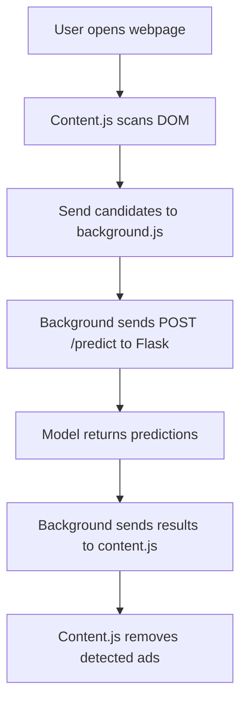

# AI Ad Blocker – Chrome Extension with Local AI Inference 🚀

A Chrome Extension (Manifest V3) that removes ads using a locally hosted machine learning model. It scans webpages, extracts DOM-based features, sends them to an AI backend via a background service worker to avoid CORS restrictions, and removes detected ads dynamically.

---

## 📌 Features

- Automatically scans webpages on load
- Extracts potential ad element candidates from HTML (including size, keyword mapping, aspect ratio, tag analysis, etc.)
- Runs inference using a local ML model via Flask backend
- Removes predicted ad elements directly from the page
- Fallback detection based on keyword matching
- Backend performance logging and API timeout detection
- CORS and Private Network Access (PNA) handling to allow localhost requests

---

## 🛠 Technologies Used

| Component | Technology |
|----------|------------|
| Extension | Manifest V3, JavaScript (ES6), DOM API |
| Worker | Chrome Background Service Worker |
| Backend | Flask (Python), numpy, scikit-learn |
| Communication | `chrome.runtime.sendMessage`, `fetch()` |
| ML Model | Scikit-learn `.pkl` model |
| UI Logic | Inline Console-Based Demo |
| Deployment | Localhost Testing (`127.0.0.1:5001`) |

---

## 🔧 Installation

### 1️⃣ AI Backend Setup
```bash
git clone https://github.com/arthurseverino/ai-adblocker.git
cd ai-adblocker/ai-backend
python3 -m venv venv
source venv/bin/activate     # On Mac/Linux
venv\Scripts\activate        # On Windows

pip install -r requirements.txt

python3 api_server.py        # Starts Flask (default: http://127.0.0.1:5001)
```

You should see logs like:
```
✓ Model loaded from ad_detector_model.pkl
AI Ad Detection API Server
Running on http://127.0.0.1:5001
```

---

### 2️⃣ Chrome Extension Setup

1. Open `chrome://extensions/`
2. Enable **Developer mode**
3. Click **Load unpacked**
4. Select the **ai-extension** folder
5. Open a webpage, check **Developer Console** (F12)

---

## 🚀 Usage Workflow



---

## 🔌 Important Code Behavior

### Backend PRE-CONFIGURED for Local Extension Calls
```python
@app.after_request
def add_private_network_header(response):
    response.headers['Access-Control-Allow-Private-Network'] = 'true'
    return response
```

### Background Worker (AI Call)
```javascript
const response = await fetch("http://127.0.0.1:5001/predict", {
  method: "POST",
  headers: {"Content-Type": "application/json"},
  body: JSON.stringify({ adCandidates }),
  signal: controller.signal
});
```

### Content.js Safety Check – Prevents removal of structural elements
```javascript
if (!selector || selector === 'div' || selector === 'section') {
  console.warn("[CONTENT] Skipping generic selector:", selector);
  return;
}
```

---

## 🧪 Test It

- Use highly ad-heavy websites for demo (e.g., `nytimes.com`, `cnet.com`, `cnn.com`, `forbes.com`)
- Open console → look for logs like:
```
[BACKGROUND] Sending 500 candidates…
[BACKGROUND] AI response received in 92ms
✓ Removed ad (87% confidence): .ad-banner
```

---

## 📈 Model Thresholds and Confidence Limits

| Setting | Value |
|--------|--------|
| Confidence threshold | `>= 80%` |
| Max candidates | `500` |
| Timeout | `30s` |
| Skip selectors | `div`, `section` |

---

## 🔮 Next Steps (Roadmap)

- ✓ Fix over-removal by limiting generic selectors
- 🔁 Improve model tuning (reduce false positives)
- 🗂 Centralize API URL in config
- 🚀 Deploy backend to persistent environment (Flask+Gunicorn or FastAPI)
- 📦 Package for Chrome Web Store
- 🖼 Optional UI for ad reporting

---

## 👥 Authors

- **Alberto Santana, Aurthur Severino, Rafid Chowdhury** – Backend integration + Chrome extension enhancements
- **Team Members** – Model training + initial extension setup

---

## 📣 Notes for Demo

> Mention that we initially trained with small dataset so aggressive removal may still happen. This version focuses on **live inference demo**, correctness tuning to follow.

---

## 🧷 Troubleshooting

| Error | Fix |
|------|-----|
| `Failed to fetch` | Ensure Flask is running on 5001 |
| `.innerText undefined` | Some elements have no text; handled by slice safety |
| Extension not updating | Click "Reload" in chrome://extensions |
| Removed too much | Lower threshold or blacklist tags |
| Port busy | Kill or switch port using `lsof -i :5001` |

---

## 🟢 Final Check

- [x] Backend running
- [x] Model loaded
- [x] Extension unpacked
- [x] Live scan logs show up
- [x] Ads removed in demo
